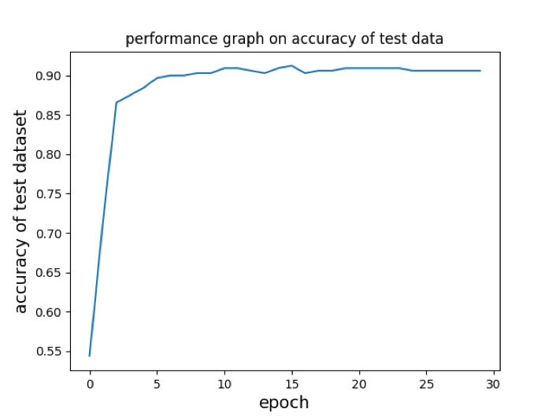
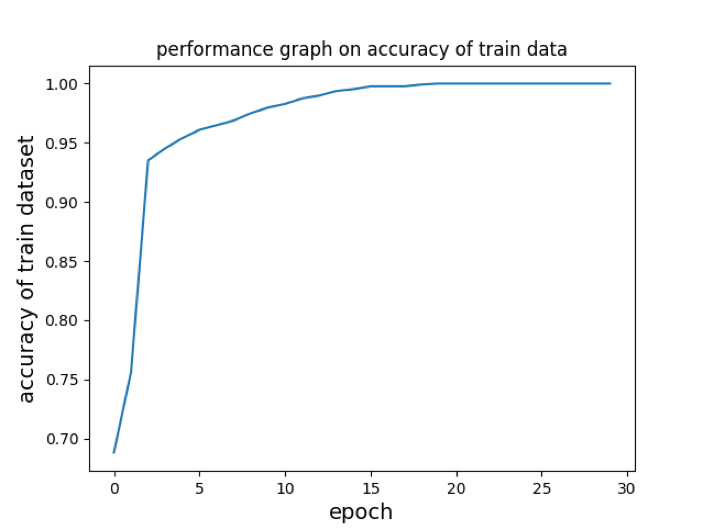
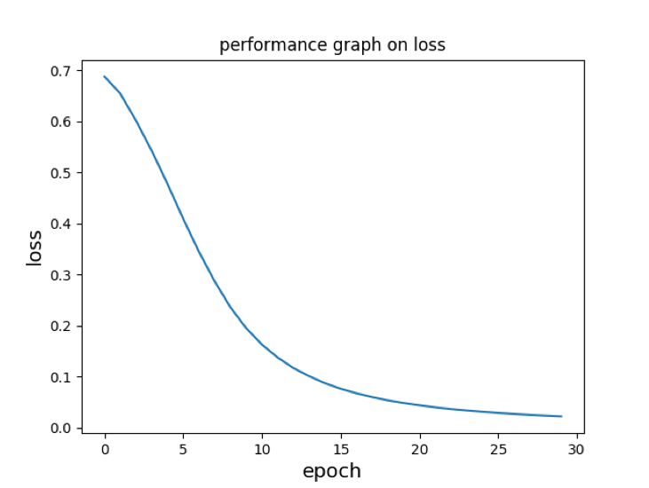
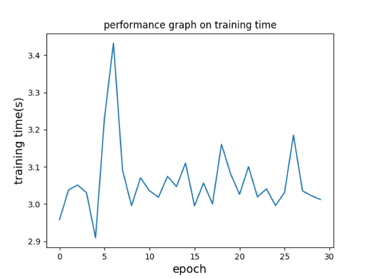

# Opinion-Spam-Detection
Build a spam checker via deep learning methods, combining with TF-IDF method.

## Problem description
The dataset contains 800 truthful and 800 deceptive (spam) reviews for hotels. Both truthful and deceptive reviews can be further divided into two categories: positive or negative review. So the corpus contains:

- 400 truthful positive reviews
- 400 deceptive positive reviews 
- 400 truthful negative reviews 
- 400 deceptive negative reviews

The goal is to build a classifier which determines whether a given review is spam or non-spam.

## Result
- Accuracy on the test data:  

- Accuracy on the training data:    

- Loss:  

  
- Training time:  

